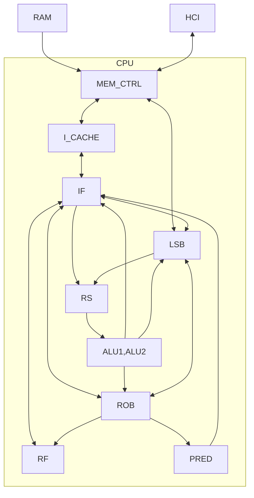
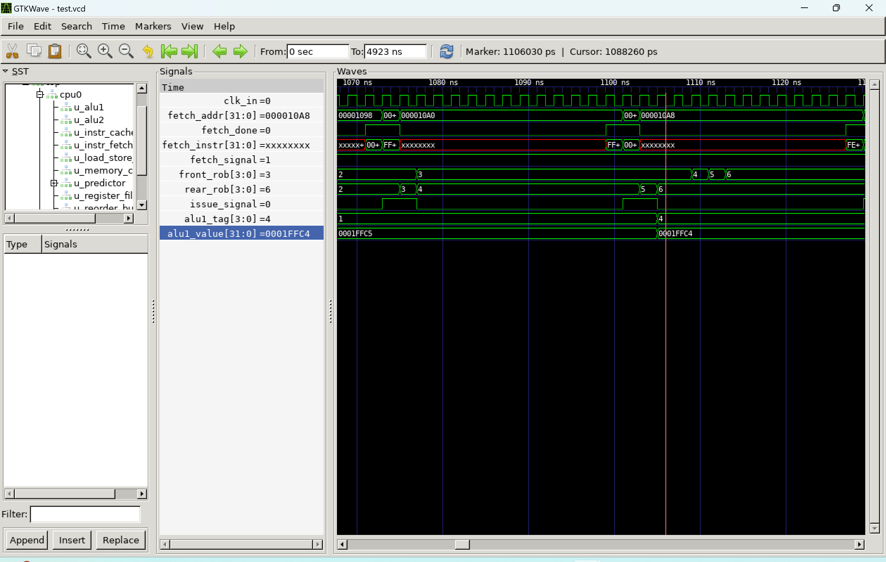

# CPU

## 架构示意图


## 各部件描述与参数

### ALU
CPU内设置2个ALU模块。对于每个ALU模块，接收到来自RS的计算请求后，可以在一个周期内完成计算，并将运算结果向RS，LSB，ROB，IF进行广播。

### RS
CPU内设置1个RS模块。RS共有16行。计算类指令发射后进入RS，计算资源准备完毕后即向ALU发送、并将指令从RS中释放。RS接收来自ALU,LSB的数据以对等待指令的计算资源进行更新。利用组合逻辑，二分接线，指示RS的空闲行和可计算行。

### RF
CPU内设置1个RF模块。RF统一管理32个通用寄存器的操作。RF记录管理每个指令对应的ROB-tag，并在指令发射时进行tag传递、指令提交时进行tag消除。

### ROB
CPU内设置1个ROB模块。ROB为16行的循环队列。指令发射后进入ROB队尾，实现指令提交的保序性。指令发射时，ROB向IF提供相关的数据信息，以实现数据的forwarding。ROB接收来自ALU,LSB的信息以实现对指令状态的更新。由于所有相关数据均已提前fowarding，因此指令提交时不再向RS，LSB中广播。

### LSB
CPU内设置1个LSB模块。LSB为16行的循环队列。
内存指令发射后进入LSB队尾，实现内存访问的保序性。LSB接收来自ALU的广播，ROB的提交信号以对等待指令的计算资源与状态进行更新。LSB与MEM_CTRL进行双向信号沟通以实现对内存的读写。对于IO写，LSB的操作基本与LOAD一致；对于IO读，LSB将等待至指令到ROB队头，以防分支预测错误时对输入流进行错误修改。LSB内置一个加法单元，实现对地址偏移量的计算，承担部分RS功能。

### MEM_CTRL
CPU内设置1个MEM_CTRL模块。MEM_CTRL统一管理CPU对RAM的读写操作。MEM_CTRL接收来自I_CACHE的读指令请求和来自LSB的内存读写请求，并将请求向RAM发送。RAM处理完毕后，将资源返回给对应模块。MEM_CTRL采用状态机来实现管理。

### I_CACHE
CPU内设置1个I_CACHE模块。I_CACHE共有256行，每行承载2条指令(64bit)。I_CACHE接收来自IF的读指令请求，并在命中时在一周期内返回(采用组合逻辑)。对于未命中的地址，I_CACHE将会向MEM_CTRL发送请求，并在收到结果后更新数据行。

### IF
CPU内设置1个IF模块。IF实现对指令的解码与发射。IF接收来自ROB，LSB，ALU，RF的信息，实现数据的forwarding，防止遗漏的情况(因为所有数据均仅广播一 次)。当I_CACHE命中时，IF能在一周期内实现指令的解码与发射，并可以进行连续的指令发射。

### PRED
CPU内设置1个PRED模块。PRED实现对BR指令的分支预测。PRED共有64个二位饱和计数器，利用指令地址进行hash。

## 乱序说明

```dump
    ...
    109c:	fff44783          	lbu   	a5,-1(s0)
    10a0:	fff40413          	addi	s0,s0,-1
    ...
```


如图所示，光标所在时刻，位于`ROB`队头(`front=3`)的是地址`109c`的`lbu`指令，它正在等待`load`完毕。然而，此时，在其后的地址`10a0`的`addi`指令(`ROB_index=4`)已经在`ALU1`中计算完毕，并向`ROB`中广播。由此，可以说明`addi`指令在`lbu`指令之前完成，证明乱序执行。


## FPGA测试
|测试点|时间(s)|
|:-----:|:------:|
|array_test1|0.006492|
|array_test2|0.009016|
|basicopt1|0.012653|
|bulgarian|1.662029|
|expr|0.004840|
|gcd|0.005465|
|hanoi|3.372278|
|heart|390.999594|
|looper|0.008617|
|lvalue2|0.002872|
|magic|0.027083|
|manyarguments|0.008485|
|multiarray|0.019463|
|pi|1.462610|
|qsort|6.483206|
|queens|3.135352|
|statement_test|0.010146|
|superloop|0.015181|
|tak|0.047645|
|testsleep|7.009583|
|uartboom|0.782057|

注：对于tak/superloop，每次运行前需要重新烧录，否则有小概率会发生结果错误